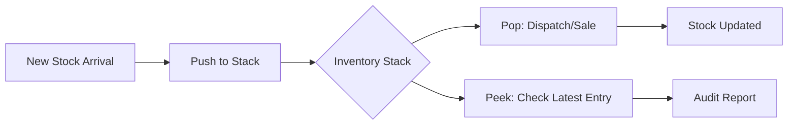

# Advanced Inventory Management System (Java GUI) 🚀

An advanced desktop application that manages inventory using a **Stack (LIFO)** data structure, featuring a rich UI, real-time statistics, and activity logging.

---
## 🧠 Logic & Data Structure
The core of this system is built on the **Stack** data structure. In an inventory context, this is ideal for scenarios where the most recently received stock needs to be processed or audited first.

### Key Operations:
* **Push (Add Item):** New stock is added to the top of the stack.
* **Pop (Remove Item):** The most recently added item is removed/sold first.
* **Peek:** View the latest item in the inventory without removing it.

---
## 📸 Project Highlights

### 1. Main Interface & Table View
A professional dashboard featuring a dynamic table that displays item positions, quantities, and total values.
![Main Interface] ![Statistics Log]

### 2. Stack Operations (Pop & Peek)
Visual confirmation of removing items (Pop) and viewing the top-most item (Peek) within the inventory stack.


### 3. Statistics & Activity Log
Real-time tracking of total inventory value and a detailed timestamped log of every action performed.


### 4. Robust Error Handling
Built-in validation to prevent incorrect data entry and ensure system stability.


---

### 🔄 Inventory Workflow Diagram


### ⚙️ How to Setup & Run
1.  **Clone the Repo:**
    ```bash
    git clone [https://github.com/bushra-waseem/Advance-Inventory-Stack-Java.git](https://github.com/bushra-waseem/Advance-Inventory-Stack-Java.git)
    ```
2.  **Open in IDE:** Import the project into **IntelliJ IDEA**, **Eclipse**, or **NetBeans**.
3.  **Compile & Run:** Run the main Java file to launch the GUI window.

---
## ✨ Advanced Features
* **Custom Stack Implementation:** Efficiently manages LIFO operations for inventory.
* **Real-time Statistics:** Automatically calculates the total value of all stock items.
* **Activity Tracking:** Log panel records every push/pop with a precise timestamp.
* **Professional UI:** Designed with Java Swing for a clean and intuitive user experience.

## 🛠️ Technical Stack
* **Language:** Java
* **UI Library:** Swing / AWT
* **Logic:** Stack Data Structure
